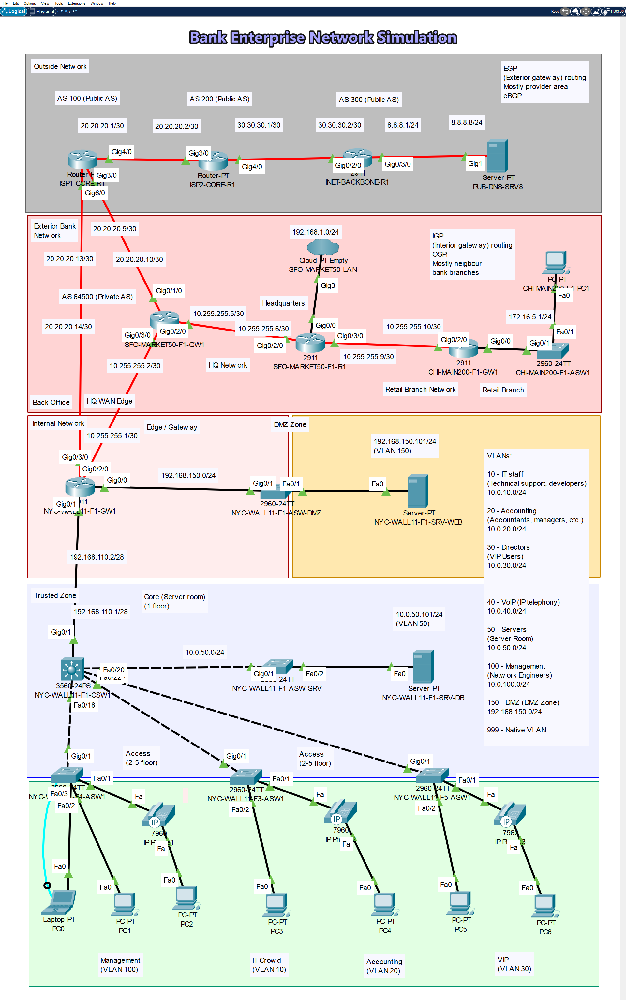

# 🏦 Enterprise Bank Network: Secure Global Infrastructure & Perimeter Defense


<p align="center">
  
</p>

## 📌 Executive Summary
This repository contains an enterprise-grade network infrastructure simulation built in **Cisco Packet Tracer**. 

**Real-World Background & NDA:** This architecture is based on a comprehensive infrastructure audit and hands-on implementation conducted during a network engineering internship at a commercial enterprise bank. To comply with strict Non-Disclosure Agreements (NDA) and protect commercial secrets, all original corporate names, IP schemas, and physical locations have been entirely abstracted. 

The simulated topology centers on a fictitious New York Headquarters (`NYC-WALL11`) and its seamless integration with regional branches (San Francisco, Chicago) across a multi-ISP global routing environment. 

**The primary objective of this project** is to demonstrate a foundational understanding of enterprise network design, L2/L3 topology configuration, traffic isolation, and network troubleshooting. The implementation of higher-layer services, such as an Nginx reverse proxy and SSL/TLS termination, was integrated strictly to validate the successful configuration of NAT and ACL rules, simulating a complete end-to-end traffic flow for a public-facing **Banking Web Service (DBO)**.

---

## 🛑 The Business Problem (As-Is Architecture)
Legacy corporate networks often suffer from "flat network" vulnerabilities. Prior to this deployment, the audited infrastructure had critical design flaws:
- **Lack of DMZ:** Public-facing services were in the same routing domain as internal corporate assets (Trusted Zone).
- **Direct L7 Exposure:** External traffic terminated directly on backend application servers without an Application Layer (L7) buffer.
- **Reconnaissance Risks:** Internal RFC 1918 IP addresses were exposed due to a lack of topology-hiding NAT translations.

## 💡 The Engineered Solution (To-Be Architecture)
To mitigate these risks, the architecture was upgraded to a **Collapsed Core** model. The new perimeter features a dedicated **Demilitarized Zone (DMZ)**, stateful-emulated Access Control Lists (Extended ACLs), and an Nginx Reverse Proxy acting as a secure traffic buffer between the global internet and internal backend servers.

---

## 🛠️ Core Technology Stack & Protocol Suite

The infrastructure implements a rigorous **Defense-in-Depth** strategy, utilizing a comprehensive suite of networking protocols across the OSI model:

### 🌐 Layer 2 (Data Link) & Campus Switching
- **VLAN (802.1Q):** Strict logical air-gapping of departments (IT, Accounting, VIPs, Server Core, DMZ).
- **STP (Spanning Tree Protocol - PVST/Rapid-PVST):** Loop prevention across the Layer 2 domain.
- **CDP (Cisco Discovery Protocol):** Dynamic Voice VLAN tagging (VLAN 40) for IP Telephony cascaded topology.
- **VTP (VLAN Trunking Protocol):** Centralized VLAN database management across the core switch.
- **L2 Hardening:** Enforced Port Security (Restrict mode), DHCP Snooping, and Native VLAN (VLAN 999) blackholing to mitigate VLAN Hopping and MAC Spoofing.

### 🔀 Layer 3 (Network) & Advanced Routing
- **IPv4 (RFC 1918):** Subnetting, VLSM (Variable Length Subnet Masking), and Inter-VLAN routing via Switched Virtual Interfaces (SVIs).
- **OSPFv2 (Open Shortest Path First):** Interior Gateway Protocol (IGP). Single-Area OSPF (`Area 0`) deployed for rapid internal convergence and dynamic default-route injection (`default-information originate`).
- **eBGP (Exterior Border Gateway Protocol):** Edge routing establishing peering sessions between the Bank's Private Autonomous System (`AS 64500`) and the Public Internet (`AS 100`, `AS 200`, `AS 300`).
- **ICMP (Internet Control Message Protocol):** Explicitly managed through ACLs for diagnostic troubleshooting (echo-reply, type 11).

### 🛡️ Layer 4 (Transport) & Perimeter Defense
- **TCP/UDP:** Port-level filtering and session tracking.
- **NAT / PAT (Network Address Translation):**
  * *NAT Overload (Dynamic PAT):* Masquerading outbound corporate traffic to hide the internal topology.
  * *Static PAT (Port Forwarding):* Deterministic inbound access, mapping the public Edge IP (`20.20.20.14:443`) strictly to the internal DMZ proxy (`192.168.150.101`).
- **Stateful ACL Emulation:** Utilized the `established` keyword within the `SECURE_DMZ` Extended ACL to permit return traffic for internally initiated TCP sessions while explicitly denying unsolicited inbound `SYN` connections.

### ⚙️ Infrastructure Management & Network Services
- **SSHv2 (Secure Shell):** Secure, encrypted out-of-band CLI management of Cisco networking devices via the dedicated Management VLAN (VLAN 100).
- **DHCP & DHCP Relay:** Dynamic IP allocation with L3 switches forwarding broadcast requests (`ip helper-address`) to the Core Server.
- **DNS (Domain Name System):** Name resolution for external public services and internal hostnames.
- **SNMP & Syslog:** Network telemetry, interface polling (Zabbix), and security event logging (Graylog).

### 💻 Layer 7 (Application) & Isolation
- **HTTP / HTTPS:** Web traffic routing and redirection.
- **SSL / TLS (TLS 1.2 / 1.3):** Cryptographic protocols utilized for secure session termination on the reverse proxy.
- **Reverse Proxy Architecture:** Nginx deployed in the DMZ to absorb external connections, terminate encryption, and completely hide backend database technologies.
- *💡 **Simulation Note:** While the L2/L3 topology, routing, and perimeter defense were built natively in Cisco Packet Tracer, the Application Layer (Ubuntu Server, Docker, Nginx, and SSL termination) was deployed and validated in a parallel **VirtualBox** environment to overcome Packet Tracer's L7 limitations.*

---

## 🗂️ Repository Structure

```text
├── configs/                                     # Extracted running-configs from network devices
│   ├── CHI-MAIN200-F1-ASW1_running-config.txt
│   ├── CHI-MAIN200-F1-GW1_running-config.txt
│   ├── INET-BACKBONE-R1_running-config.txt
│   ├── ISP1-CORE-R1_running-config.txt
│   ├── ISP2-CORE-R1_running-config.txt
│   ├── ISP2-CORE-R1_startup-config.txt
│   ├── NYC-WALL11-F1-ASW-DMZ_running-config.txt
│   ├── NYC-WALL11-F1-ASW-SRV_running-config.txt
│   ├── NYC-WALL11-F1-CSW1_running-config.txt    # HQ Collapsed Core L3 Switch
│   ├── NYC-WALL11-F1-GW1_running-config.txt     # HQ Edge Router (NAT, ACL, eBGP)
│   ├── NYC-WALL11-F3-ASW1_running-config.txt
│   ├── NYC-WALL11-F4-ASW1_running-config.txt
│   ├── NYC-WALL11-F5-ASW1_running-config.txt
│   ├── SFO-MARKET50-F1-GW1_running-config.txt
│   └── SFO-MARKET50-F1-R1_running-config.txt
├── screenshots/                                 # Proof of concept and verification tests
│   ├── PacketTracer_2gl1gKOcmt.png
│   ├── PacketTracer_3aA6TntTnv.png
│   ├── PacketTracer_5nbk56kfFS.png
│   ├── PacketTracer_FHLajCCW7Q.png
│   ├── PacketTracer_HQqvf7BNUh.png
│   └── PacketTracer_iJKKwaCCuY.png
├── wikis/                                       # Low-Level Design (LLD) documentation
│   ├── Wiki-1.md                                # Network Architecture & Routing Engineering
│   ├── Wiki-2.md                                # Security Architecture & Perimeter Defense
│   └── Wiki-3.md                                # Web Services & Application Security
├── Enterprise-Bank-Network.pkt                  # Main Cisco Packet Tracer project file
├── Enterprise-Bank-Network-Topology.png         # Full L2/L3 Logical Topology
└── README.md                                    # Executive summary and project overview

```

---

---

## 📂 Repository Documentation (Low-Level Design)

For a deep dive into the engineering rationale, trade-offs, and security modeling behind this architecture, please review the project Wikis:

* 📄 **[Wiki 1: Network Architecture & Routing Engineering](./wiki/Wiki-1.md)** — Collapsed Core paradigm, OSPF Area 0 logic, VLAN schema, and eBGP AS topologies.
* 📄 **[Wiki 2: Security Architecture & Perimeter Defense](./wiki/Wiki-2.md)** — Threat Modeling, DMZ isolation, Static PAT vs. 1:1 NAT, Extended ACL logic.
* 📄 **[Wiki 3: Web Services & Application Security](./wiki/Wiki-3.md)** — The necessity of the L7 Reverse Proxy buffer zone and HTTP-to-HTTPS redirection.

---

## 🚀 How to Run the Simulation

1. Download `Enterprise-Bank-Network.pkt` from this repository.
2. Open using **Cisco Packet Tracer v8.x** or higher.
3. **Verify Edge Connectivity:** Open the simulated external PC ("Outside Network", IP `8.8.8.8`) and navigate to `https://20.20.20.14` in the Web Browser. The Banking Service will load successfully via the BGP and NAT infrastructure.
4. **Verify L3 Isolation:** Open the DMZ Web Server (`192.168.150.101`) and attempt to ping the internal Core Database Server (`10.0.50.101`). The ICMP packets will be actively dropped by the Edge Router's `SECURE_DMZ` Extended ACL, proving blast-radius containment.
